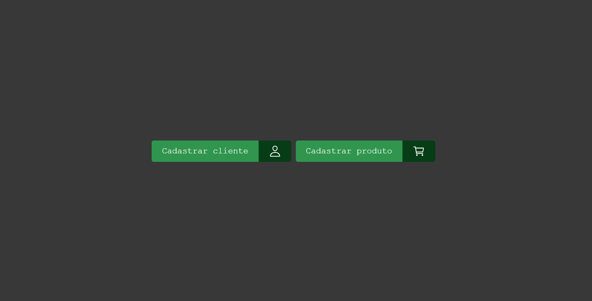
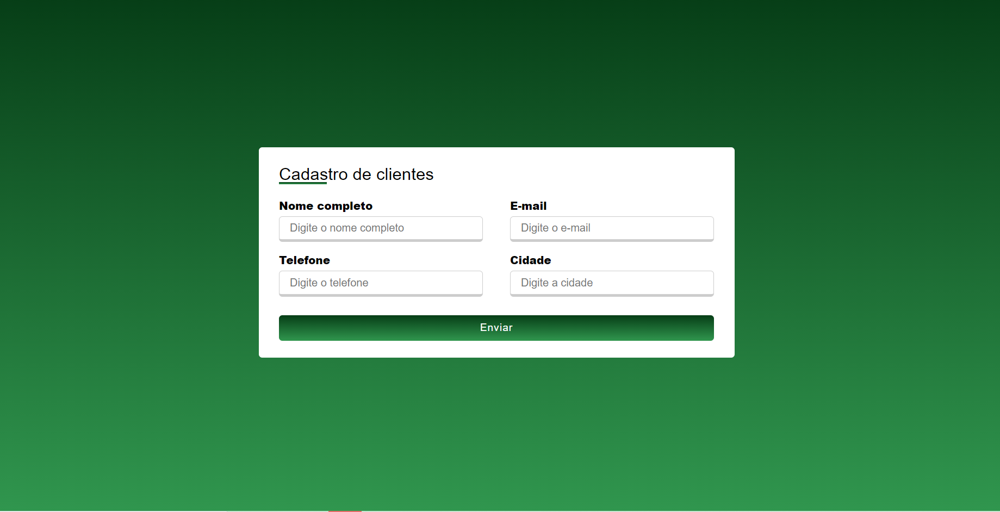

###### **developed by: Eduardo Lima**

<h1 align = 'center'>  Cadastro E-commerce</h1>
<h2 align = 'center'>
<a href="https://cadastro-e-commerce-hiringcoders.netlify.app">Site</a>
</h2>

  
  

---

## 📗 Sobre

Esse é um projeto inicial de um sistema de cadastro de clientes e produtos para um e-commerce, desenvolvido para o curso Hiring Coders. Os dados são armazenados em LocalStorage.

---

## 💻 Tecnologias

- HTML
- CSS
- JAVASCRIPT

---

